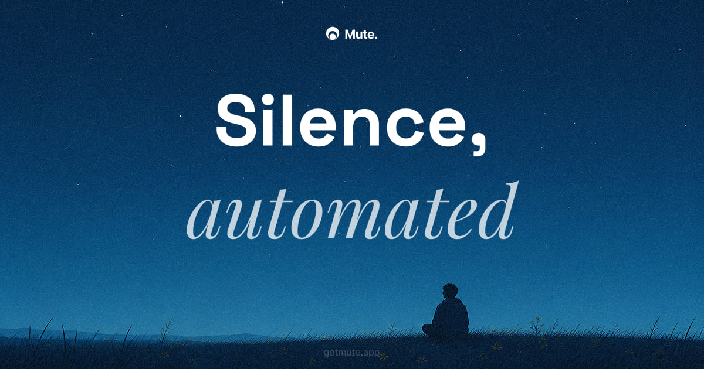

<div align="center">

# Mute

A macOS menu bar app that automatically activates Do Not Disturb when your microphone or camera is in use.



</div>

No configuration required. Works with Zoom, Teams, Meet, FaceTime, and any other app that accesses your mic or camera.

## Install

Requires macOS 26 or later.

### Mac App Store

[**Download on the Mac App Store**](https://apps.apple.com/us/app/mute-silence-automated/id6790570476)

> Not available in the EU due to App Store trader-status requirements. EU users, install via Homebrew or the direct download below.

### Homebrew

```bash
brew install --cask kurama/tap/mute
```

### Direct download

Download the latest notarized `.dmg` from the [Releases page](https://github.com/kurama/mute/releases).

## Build from source

This repository is for contributors. To build locally:

```bash
git clone https://github.com/kurama/mute.git
cd mute
open mute.xcodeproj
```

Set your development team under **Signing & Capabilities**, then press `Cmd+R`.

On first launch, Mute will guide you through a short onboarding that installs two macOS Shortcuts used to toggle Focus mode.

## How it works

**Microphone detection** uses CoreAudio's `kAudioDevicePropertyDeviceIsRunningSomewhere` — the same signal that drives the orange mic indicator in the menu bar.

**Camera detection** uses `AVCaptureDevice.isInUseByAnotherApplication` via KVO, with a 2-second polling fallback.

**Do Not Disturb** is toggled via two bundled macOS Shortcuts ("Mute On" / "Mute Off"), which call the native Focus API. This approach avoids private APIs and works without special entitlements.

## Menu options

- Enable / Disable Mute
- Trigger on: Mic & Camera / Mic only / Camera only

## License

MIT
